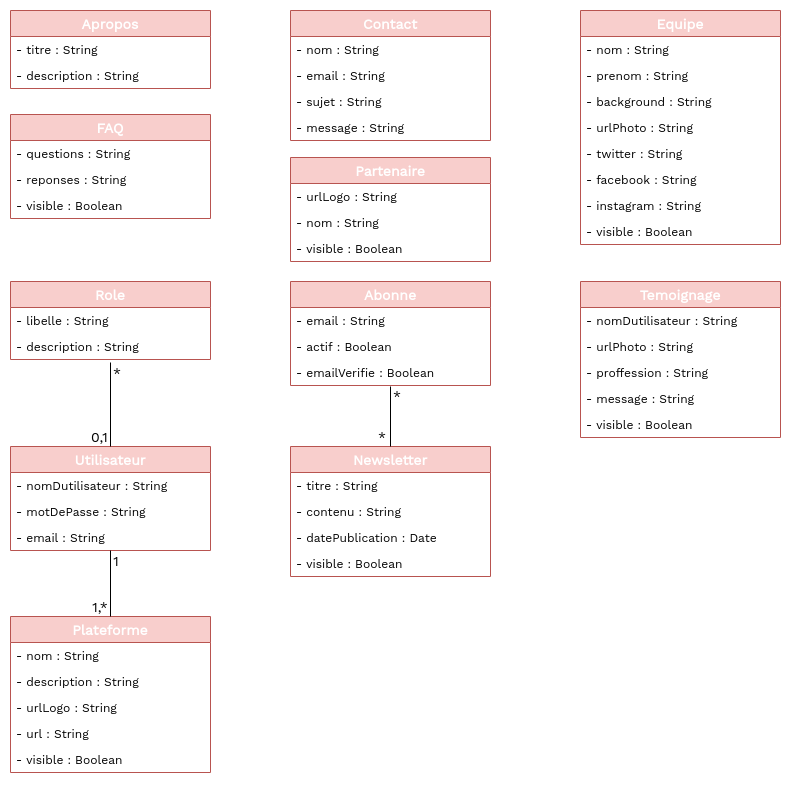

## Description des classes 

Description des classes qui seront utilisées pour l'implémentation de la plateforme

| Classe | Champs | Description |
| -------- | ----------- | --------------- |
| **Apropos** | titre, description | Sera utilisée pour remplir la section [A propos] sur l'annuaire |
| **Temoignage** | nomDutilisateur, urlPhoto, profession, message, visible | Permettra de repertorié les témoignages et des les afficher dans la section [Témoignages] |
| **Faq** | question, reponse, visible | Permettra de remplir la sesction [Faq] |
| **Equipe** | nom, prenom , backgroud, urlPhoto, facebook, twitter, linkedIn | Permettra de données les informations sur [les membres de l'équipe] |
| **Partenaire** | urlLogo, nom, visible | Contiendra les informations qui rempliront la sectiont [Partenaires] |
| **Abonne** | email, emailVerifie, estActif | Contiendra la liste des abonnés aux newsletters |
| **Newsletter** | titre, contenu, datePublication, visible | Contiendra la liste des messages (newsletters) |
| **Plateforme** |  nom, logo, description, url, urlLogo | Contiendra les informations relatifs aux autres plate-forme de données libres |
| **Utilisateur** | nom_utilisateur, email, mot_de_passe | Contiendra les informations relatives aux utilisateurs de la plateforme |
| **Role** | libellé, description | Contiendra les différents rôles des utilisateurs du système et Permettra de leur donner accès aux ressources spécifiques |

